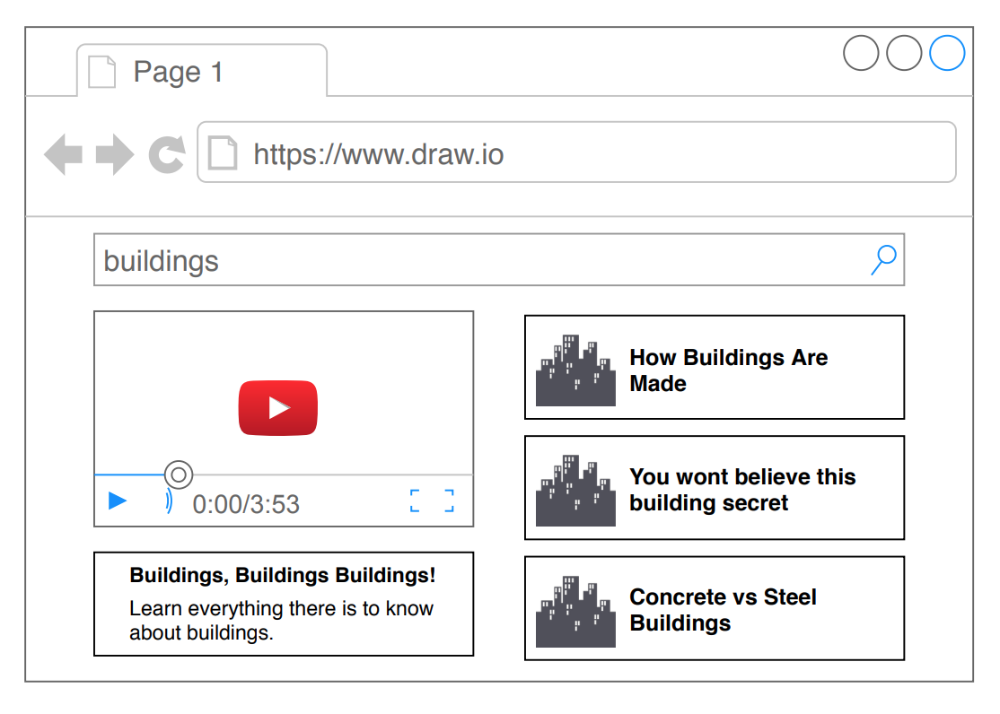
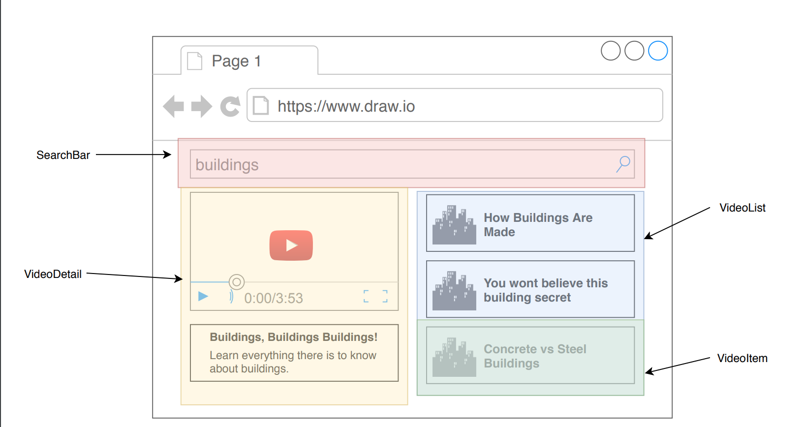

This project was bootstrapped with [Create React App](https://github.com/facebook/create-react-app).

## Available Scripts

In the project directory, you can run:

### `npm start`

Runs the app in the development mode. 
Open [http://localhost:3000](http://localhost:3000) to view it in the browser.

The page will reload if you make edits. 
You will also see any lint errors in the console.

### `npm test`

Launches the test runner in the interactive watch mode. 
See the section about [running tests](https://facebook.github.io/create-react-app/docs/running-tests) for more information.

### `npm run build`

Builds the app for production to the `build` folder. 
It correctly bundles React in production mode and optimizes the build for the best performance.

The build is minified and the filenames include the hashes. 
Your app is ready to be deployed!

See the section about [deployment](https://facebook.github.io/create-react-app/docs/deployment) for more information.

### `npm run eject`

**Note: this is a one-way operation. Once you `eject`, you can’t go back!**

If you aren’t satisfied with the build tool and configuration choices, you can `eject` at any time. This command will remove the single build dependency from your project.

Instead, it will copy all the configuration files and the transitive dependencies (Webpack, Babel, ESLint, etc) right into your project so you have full control over them. All of the commands except `eject` will still work, but they will point to the copied scripts so you can tweak them. At this point you’re on your own.

You don’t have to ever use `eject`. The curated feature set is suitable for small and middle deployments, and you shouldn’t feel obligated to use this feature. However we understand that this tool wouldn’t be useful if you couldn’t customize it when you are ready for it.

## Learn More

You can learn more in the [Create React App documentation](https://facebook.github.io/create-react-app/docs/getting-started).

To learn React, check out the [React documentation](https://reactjs.org/).
=======
# metube
Headway - React Project

# App Overview
This is essentially going to be a YouTube browser application in code, approach and design.

At the very top a user is going to enter in some search term, for example, in this case, I used
buildings.

After the write out the search term in the search bar, the user will hit enter which is going to trigger a
search request over to the YouTube API.

Once a user gets a list of videos back from this YouTube API they will be displayed on the right hand
side of the browser. The user will then be able to click on one of these videos and it will be featured in
the top left so the user can click on the actual video. The user will be shown a video title and
description and will also be able to watch the video by clicking the play button.
So this React application will have a search bar, its going to make a request to an outside API, its
going to render a list of items which are features that any React engineer worth his salt should be
able to do.

# Component Design
So I have taken this mockup and broken it down into separate components so that I can get a good idea of what I am going to be building as I work on the application.

So the above mockup is my idea on how I am going to split this up into separate components.

I think I will have a search bar component at the top of the screen. This search bar is going to show some text input. A user can type in the search bar and this will update my state and then anytime a user hits the enter key, that will trigger a form submit event and send that search term back up to some other app component or parent component which will then take that search term and do an actual API request.

On the right hand side I will have a VideoList that is going to render the entire list of videos.

And then each of those individual parts or each of those individual boxes will be a component called VideoItem.

So if VideoItem is one particular video then all the video items will be contained by the VideoList component.

This explains why I have a green box around one VideoItem inside of the blue box that encompasses all the items in the VideoList component.

Finally, I will add the VideoDetail component which will be responsible for actually showing a video player that can play the actual YouTube video that has been fetched and the title and description right underneath the video.

So these are going to be the actual videos from YouTube that will be playing in this application minus the commercials.

I need to figure out how I am going to actually show a video directly from YouTube and embed it inside my application, but I suspect this will be fairly straightforward.

The next thing I want to show you below is my component hierarchy.
